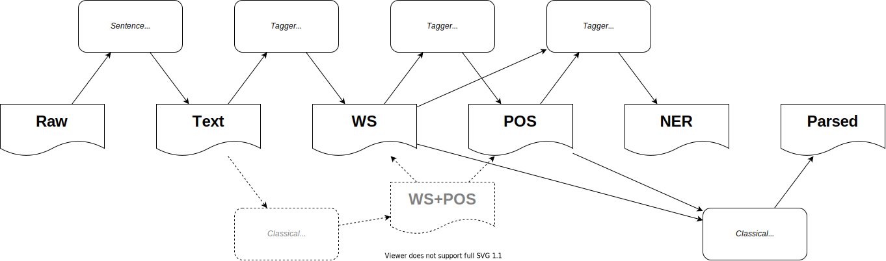
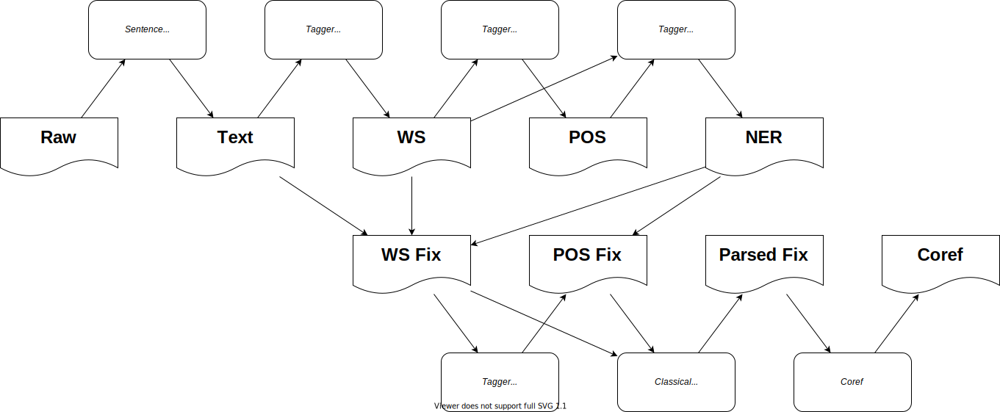

Introduction
============

Official CKIP CoreNLP Toolkits

Features
--------

- Sentence Segmentation
- Word Segmentation
- Part-of-Speech Tagging
- Sentence Parsing
- Named-Entity Recognition
- Co-Reference Delectation

Git
---

https://github.com/ckiplab/ckipnlp

|GitHub Version| |GitHub Release| |GitHub Issues|

.. |GitHub Version| image:: https://img.shields.io/github/v/release/ckiplab/ckipnlp.svg?maxAge=3600
   :target: https://github.com/ckiplab/ckipnlp/releases

.. |GitHub License| image:: https://img.shields.io/github/license/ckiplab/ckipnlp.svg?maxAge=3600
   :target: https://github.com/ckiplab/ckipnlp/blob/master/LICENSE

.. |GitHub Release| image:: https://img.shields.io/github/release-date/ckiplab/ckipnlp.svg?maxAge=3600

.. |GitHub Downloads| image:: https://img.shields.io/github/downloads/ckiplab/ckipnlp/total.svg?maxAge=3600
   :target: https://github.com/ckiplab/ckipnlp/releases/latest

.. |GitHub Issues| image:: https://img.shields.io/github/issues/ckiplab/ckipnlp.svg?maxAge=3600
   :target: https://github.com/ckiplab/ckipnlp/issues

.. |GitHub Forks| image:: https://img.shields.io/github/forks/ckiplab/ckipnlp.svg?style=social&label=Fork&maxAge=3600

.. |GitHub Stars| image:: https://img.shields.io/github/stars/ckiplab/ckipnlp.svg?style=social&label=Star&maxAge=3600

.. |GitHub Watchers| image:: https://img.shields.io/github/watchers/ckiplab/ckipnlp.svg?style=social&label=Watch&maxAge=3600

PyPI
----

https://pypi.org/project/ckipnlp

|PyPI Version| |PyPI License| |PyPI Downloads| |PyPI Python| |PyPI Implementation| |PyPI Status|

.. |PyPI Version| image:: https://img.shields.io/pypi/v/ckipnlp.svg?maxAge=3600
   :target: https://pypi.org/project/ckipnlp

.. |PyPI License| image:: https://img.shields.io/pypi/l/ckipnlp.svg?maxAge=3600
   :target: https://github.com/ckiplab/ckipnlp/blob/master/LICENSE

.. |PyPI Downloads| image:: https://img.shields.io/pypi/dm/ckipnlp.svg?maxAge=3600
   :target: https://pypi.org/project/ckipnlp#files

.. |PyPI Python| image:: https://img.shields.io/pypi/pyversions/ckipnlp.svg?maxAge=3600

.. |PyPI Implementation| image:: https://img.shields.io/pypi/implementation/ckipnlp.svg?maxAge=3600

.. |PyPI Format| image:: https://img.shields.io/pypi/format/ckipnlp.svg?maxAge=3600

.. |PyPI Status| image:: https://img.shields.io/pypi/status/ckipnlp.svg?maxAge=3600

Documentation
-------------

https://ckipnlp.readthedocs.io/

|ReadTheDocs Home|

.. |ReadTheDocs Home| image:: https://img.shields.io/website/https/ckipnlp.readthedocs.io.svg?maxAge=3600&up_message=online&down_message=offline
   :target: http://ckipnlp.readthedocs.io

Contributers
------------

* `Mu Yang <http://muyang.pro>`_ at `CKIP <https://ckip.iis.sinica.edu.tw>`_ (Author & Maintainer)
* `Wei-Yun Ma <https://www.iis.sinica.edu.tw/pages/ma/>`_ at `CKIP <https://ckip.iis.sinica.edu.tw>`_ (Maintainer)
* `DouglasWu <dgrey1116@gmail.com>`_

External Links
--------------

- `Online Demo <https://ckip.iis.sinica.edu.tw/service/corenlp>`_

Installation
============

Requirements
------------

* `Python <http://www.python.org>`_ 3.6+
* `TreeLib <https://treelib.readthedocs.io>`_ 1.5+

* `CkipTagger <https://pypi.org/project/ckiptagger>`_ 0.1.1+ [Optional, Recommended]
* `CkipClassic <https://ckip-classic.readthedocs.io>`_ 1.0+ [Optional]

Tool Requirements
-----------------

================================  ========  ==========  ===========
Tool                              Built-in  CkipTagger  CkipClassic
================================  ========  ==========  ===========
Sentence Segmentation             ✔
Word Segmentation†                          ✔           ✔
Part-of-Speech Tagging†                     ✔           ✔
Sentence Parsing                                        ✔
Named-Entity Recognition                    ✔
Co-Reference Delectation‡         ✔         ✔           ✔
================================  ========  ==========  ===========

- † These tools require only one of either backends.
- ‡ Co-Reference implementation does not require any backend, but requires results from word segmentation, part-of-speech tagging, sentence parsing, and named-entity recognition.

Installation via Pip
--------------------

- No backend (not recommended): ``pip install ckipnlp``.
- With CkipTagger backend (recommended): ``pip install ckipnlp[tagger]``.
- With CkipClassic backend: ``pip install ckipnlp[classic]``.
- With both backend: ``pip install ckipnlp[tagger,classic]``.

Please refer https://ckip-classic.readthedocs.io for CkipClassic installation guide.

Usage
=====

See http://ckipnlp.readthedocs.io/en/latest/_api/ckipnlp.html for API details.

Pipelines
---------

Core Pipeline
^^^^^^^^^^^^^

.. code-block:: python

   from ckipnlp.pipeline import CkipPipeline, CkipDocument

   pipeline = CkipPipeline()
   doc = CkipDocument(
      raw='中文字喔，啊哈哈哈',
   )

   # Word Segmentation
   pipeline.get_ws(doc)
   print(doc.ws)
   for line in doc.ws:
       print(line.to_text())

   # Part-of-Speech Tagging
   pipeline.get_pos(doc)
   print(doc.pos)
   for line in doc.pos:
       print(line.to_text())

   # Named-Entity Recognition
   pipeline.get_ner(doc)
   print(doc.ner)

   # Sentence Parsing
   pipeline.get_parsed(doc)
   print(doc.parsed)

   ################################################################

   from ckipnlp.container.util.wspos import WsPosParagraph

   # Word Segmentation & Part-of-Speech Tagging
   for line in WsPosParagraph.to_text(doc.ws, doc.pos):
       print(line)

Co-Reference Pipeline
^^^^^^^^^^^^^^^^^^^^^

.. code-block:: python

   from ckipnlp.pipeline import CkipCorefPipeline, CkipDocument

   pipeline = CkipCorefPipeline()
   doc = CkipDocument(
      raw='畢卡索他想，完蛋了',
   )

   # Co-Reference
   corefdoc = pipeline(doc)
   print(corefdoc.coref)
   for line in corefdoc.coref:
       print(line.to_text())

Containers
----------

.. |TextParagraph| replace:: :class:`TextParagraph <ckipnlp.container.text.TextParagraph>`
.. |SegSentence| replace:: :class:`SegSentence <ckipnlp.container.seg.SegSentence>`
.. |SegParagraph| replace:: :class:`SegParagraph <ckipnlp.container.seg.SegParagraph>`
.. |NerToken| replace:: :class:`NerToken <ckipnlp.container.ner.NerToken>`
.. |NerSentence| replace:: :class:`NerSentence <ckipnlp.container.ner.NerSentence>`
.. |NerParagraph| replace:: :class:`NerParagraph <ckipnlp.container.ner.NerParagraph>`
.. |ParsedParagraph| replace:: :class:`ParsedParagraph <ckipnlp.container.parsed.ParsedParagraph>`
.. |CorefToken| replace:: :class:`CorefToken <ckipnlp.container.coref.CorefToken>`
.. |CorefSentence| replace:: :class:`CorefSentence <ckipnlp.container.coref.CorefSentence>`
.. |CorefParagraph| replace:: :class:`CorefParagraph <ckipnlp.container.coref.CorefParagraph>`

.. |WsPosToken| replace:: :class:`WsPosToken <ckipnlp.container.util.wspos.WsPosToken>`
.. |WsPosSentence| replace:: :class:`WsPosSentence <ckipnlp.container.util.wspos.WsPosSentence>`
.. |WsPosParagraph| replace:: :class:`WsPosParagraph <ckipnlp.container.util.wspos.WsPosParagraph>`

.. |ParsedNodeData| replace:: :class:`ParsedNodeData <ckipnlp.container.util.parsed_tree.ParsedNodeData>`
.. |ParsedNode| replace:: :class:`ParsedNode <ckipnlp.container.util.parsed_tree.ParsedNode>`
.. |ParsedRelation| replace:: :class:`ParsedRelation <ckipnlp.container.util.parsed_tree.ParsedRelation>`
.. |ParsedTree| replace:: :class:`ParsedTree <ckipnlp.container.util.parsed_tree.ParsedTree>`

The container objects provides

-  :meth:`from_text()`, :meth:`to_text()` for plain-text format conversions;
-  :meth:`from_dict()`, :meth:`to_dict()` for dictionary-like format conversions;
-  :meth:`from_list()`, :meth:`to_list()` for list-like format conversions;
-  :meth:`from_json()`, :meth:`to_json()` for JSON format conversions (based-on dictionary-like format conversions).

The following are the interfaces, where ``CONTAINER_CLASS`` refers to the container class.

.. code-block:: python

   obj = CONTAINER_CLASS.from_text(plain_text)
   plain_text = obj.to_text()

   obj = CONTAINER_CLASS.from_dict({ key: value })
   dict_obj = obj.to_dict()

   obj = CONTAINER_CLASS.from_list([ value1, value2 ])
   list_obj = obj.to_list()

   obj = CONTAINER_CLASS.from_json(json_str)
   json_str = obj.to_json()

Note that not all container provide all above methods. Here is the table of implemented methods. Please refer the documentation of each container for detail formats.

========================  ========================  ============  ======================
Container                 Item                      from/to text  from/to dict/list/json
========================  ========================  ============  ======================
|TextParagraph|           :class:`str`              ✔             ✔
|SegSentence|             :class:`str`              ✔             ✔
|SegParagraph|            |SegSentence|             ✔             ✔
|NerToken|                ✘                                       ✔
|NerSentence|             |NerToken|                              ✔
|NerParagraph|            |NerSentence|                           ✔
|ParsedParagraph|         :class:`str`              ✔             ✔
|CorefToken|              ✘                         only to       ✔
|CorefSentence|           |CorefToken|              only to       ✔
|CorefParagraph|          |CorefSentence|           only to       ✔
========================  ========================  ============  ======================

WS with POS
^^^^^^^^^^^

There are also conversion routines for word-segmentation and POS containers jointly. For example, |WsPosToken| provides routines for a word (:class:`str`) with POS-tag (:class:`str`):

.. code-block:: python

   ws_obj, pos_obj = WsPosToken.from_text('中文字(Na)')
   plain_text = WsPosToken.to_text(ws_obj, pos_obj)

   ws_obj, pos_obj = WsPosToken.from_dict({ 'word': '中文字', 'pos': 'Na', })
   dict_obj = WsPosToken.to_dict(ws_obj, pos_obj)

   ws_obj, pos_obj = WsPosToken.from_list([ '中文字', 'Na' ])
   list_obj = WsPosToken.to_list(ws_obj, pos_obj)

   ws_obj, pos_obj = WsPosToken.from_json(json_str)
   json_str = WsPosToken.to_json(ws_obj, pos_obj)

Similarly, |WsPosSentence|/|WsPosParagraph| provides routines for word-segmented and POS sentence/paragraph (|SegSentence|/|SegParagraph|) respectively.

Parsed Tree
^^^^^^^^^^^

License
=======

|CC BY-NC-SA 4.0|

Copyright (c) 2018-2020 `CKIP Lab <https://ckip.iis.sinica.edu.tw>`_ under the `CC BY-NC-SA 4.0 License <http://creativecommons.org/licenses/by-nc-sa/4.0/>`_.

.. |CC BY-NC-SA 4.0| image:: https://i.creativecommons.org/l/by-nc-sa/4.0/88x31.png
   :target: http://creativecommons.org/licenses/by-nc-sa/4.0/
