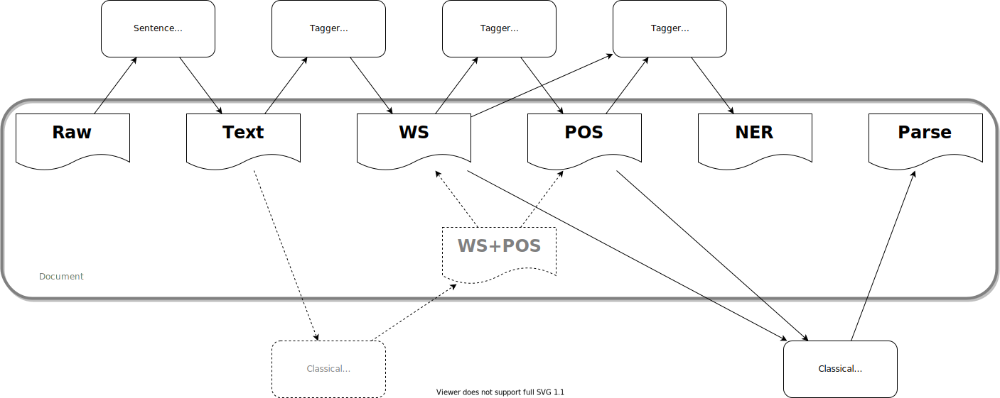
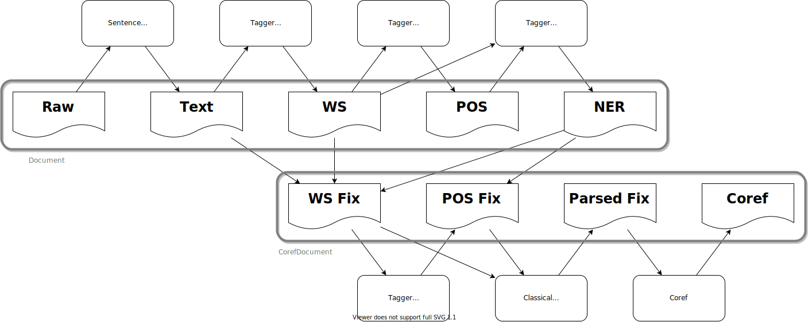

Usage
=====

Pipelines
---------

Core Pipeline
^^^^^^^^^^^^^

The |CkipPipeline| connect drivers of sentence segmentation, word segmentation, part-of-speech tagging, named-entity recognition, and sentence parsing.

The |CkipDocument| is the workspace of |CkipPipeline| with input/output data. Note that |CkipPipeline| will store the result into |CkipDocument| in-place.

The |CkipPipeline| will compute all necessary dependencies. For example, if one calls :meth:`get_ner()` with only raw-text input, the pipeline will automatically calls :meth:`get_text()`, :meth:`get_ws()`, :meth:`get_pos()`.

.. code-block:: python

   from ckipnlp.pipeline import CkipPipeline, CkipDocument

   pipeline = CkipPipeline()
   doc = CkipDocument(raw='中文字喔，啊哈哈哈')

   # Word Segmentation
   pipeline.get_ws(doc)
   print(doc.ws)
   for line in doc.ws:
       print(line.to_text())

   # Part-of-Speech Tagging
   pipeline.get_pos(doc)
   print(doc.pos)
   for line in doc.pos:
       print(line.to_text())

   # Named-Entity Recognition
   pipeline.get_ner(doc)
   print(doc.ner)

   # Sentence Parsing
   pipeline.get_parsed(doc)
   print(doc.parsed)

   ################################################################

   from ckipnlp.container.util.wspos import WsPosParagraph

   # Word Segmentation & Part-of-Speech Tagging
   for line in WsPosParagraph.to_text(doc.ws, doc.pos):
       print(line)

Co-Reference Pipeline
^^^^^^^^^^^^^^^^^^^^^

The |CkipCorefPipeline| is a extension of |CkipPipeline| by providing co-reference detection. The pipeline first do named-entity recognition as |CkipPipeline| do, followed by alignment algorithms to fix the word-segmentation and part-of-speech tagging outputs, and then do co-reference detection based sentence parsing result.

The |CkipCorefDocument| is the workspace of |CkipCorefPipeline| with input/output data. Note that |CkipCorefDocument| will store the result into |CkipCorefPipeline|.

.. code-block:: python

   from ckipnlp.pipeline import CkipCorefPipeline, CkipDocument

   pipeline = CkipCorefPipeline()
   doc = CkipDocument(raw='畢卡索他想，完蛋了')

   # Co-Reference
   corefdoc = pipeline(doc)
   print(corefdoc.coref)
   for line in corefdoc.coref:
       print(line.to_text())

Drivers
^^^^^^^

CkipNLP provides several alternative drivers for above two pipelines. Here are the list of the drivers:

================================  ================================  ================================  ================================
|DriverType|                      |DriverBUILTIN|                   |DriverTAGGER|                    |DriverCLASSIC|
================================  ================================  ================================  ================================
SENTENCE_SEGMENTER                |CkipSentenceSegmenter|
WORD_SEGMENTER                                                      |CkipTaggerWordSegmenter|         |CkipClassicWordSegmenter|†
POS_TAGGER                                                          |CkipTaggerPosTagger|             |CkipClassicWordSegmenter|†
NER_CHUNKER                                                         |CkipTaggerNerChunker|
SENTENCE_PARSER                                                                                       |CkipClassicSentenceParser|
COREF_CHUNKER                     |CkipCorefChunker|
================================  ================================  ================================  ================================

† Not compatible with |CkipCorefPipeline|.

Containers
----------

The container objects provides following methods:

-  :meth:`from_text()`, :meth:`to_text()` for plain-text format conversions;
-  :meth:`from_dict()`, :meth:`to_dict()` for dictionary-like format conversions;
-  :meth:`from_list()`, :meth:`to_list()` for list-like format conversions;
-  :meth:`from_json()`, :meth:`to_json()` for JSON format conversions (based-on dictionary-like format conversions).

The following are the interfaces, where ``CONTAINER_CLASS`` refers to the container class.

.. code-block:: python

   obj = CONTAINER_CLASS.from_text(plain_text)
   plain_text = obj.to_text()

   obj = CONTAINER_CLASS.from_dict({ key: value })
   dict_obj = obj.to_dict()

   obj = CONTAINER_CLASS.from_list([ value1, value2 ])
   list_obj = obj.to_list()

   obj = CONTAINER_CLASS.from_json(json_str)
   json_str = obj.to_json()

Note that not all container provide all above methods. Here is the table of implemented methods. Please refer the documentation of each container for detail formats.

========================  ========================  ============  ========================
Container                 Item                      from/to text  from/to dict, list, json
========================  ========================  ============  ========================
|TextParagraph|           |str|                     ✔             ✔
|SegSentence|             |str|                     ✔             ✔
|SegParagraph|            |SegSentence|             ✔             ✔
|NerToken|                ✘                                       ✔
|NerSentence|             |NerToken|                              ✔
|NerParagraph|            |NerSentence|                           ✔
|ParsedParagraph|         |str|                     ✔             ✔
|CorefToken|              ✘                         only to       ✔
|CorefSentence|           |CorefToken|              only to       ✔
|CorefParagraph|          |CorefSentence|           only to       ✔
========================  ========================  ============  ========================

WS with POS
^^^^^^^^^^^

There are also conversion routines for word-segmentation and POS containers jointly. For example, |WsPosToken| provides routines for a word (|str|) with POS-tag (|str|):

.. code-block:: python

   ws_obj, pos_obj = WsPosToken.from_text('中文字(Na)')
   plain_text = WsPosToken.to_text(ws_obj, pos_obj)

   ws_obj, pos_obj = WsPosToken.from_dict({ 'word': '中文字', 'pos': 'Na', })
   dict_obj = WsPosToken.to_dict(ws_obj, pos_obj)

   ws_obj, pos_obj = WsPosToken.from_list([ '中文字', 'Na' ])
   list_obj = WsPosToken.to_list(ws_obj, pos_obj)

   ws_obj, pos_obj = WsPosToken.from_json(json_str)
   json_str = WsPosToken.to_json(ws_obj, pos_obj)

Similarly, |WsPosSentence|/|WsPosParagraph| provides routines for word-segmented and POS sentence/paragraph (|SegSentence|/|SegParagraph|) respectively.

Parsed Tree
^^^^^^^^^^^

In addition to |ParsedParagraph|, we have implemented tree utilities base on `TreeLib <https://treelib.readthedocs.io>`_.

|ParsedTree| is the tree structure of a parsed sentence. One may use :meth:`from_text()` and :meth:`to_text()` for plain-text conversion; :meth:`from_dict()`, :meth:`to_dict()` for dictionary-like object conversion; and also :meth:`from_json()`, :meth:`to_json()` for JSON string conversion.

The |ParsedTree| is a `TreeLib <https://treelib.readthedocs.io>`_ tree with |ParsedNode| as its nodes. The data of these nodes is stored in a |ParsedNodeData| (accessed by ``node.data``), which is a tuple of ``role`` (semantic role), ``pos`` (part-of-speech tagging), ``word``.

|ParsedTree| provides useful methods: :meth:`get_heads()` finds the head words of the sentence; :meth:`get_relations()` extracts all relations in the sentence; :meth:`get_subjects()` returns the subjects of the sentence.

.. code-block:: python

   from ckipnlp.container import ParsedTree

   # 我的早餐、午餐和晚餐都在那場比賽中被吃掉了
   tree_text = 'S(goal:NP(possessor:N‧的(head:Nhaa:我|Head:DE:的)|Head:Nab(DUMMY1:Nab(DUMMY1:Nab:早餐|Head:Caa:、|DUMMY2:Naa:午餐)|Head:Caa:和|DUMMY2:Nab:晚餐))|quantity:Dab:都|condition:PP(Head:P21:在|DUMMY:GP(DUMMY:NP(Head:Nac:比賽)|Head:Ng:中))|agent:PP(Head:P02:被)|Head:VC31:吃掉|aspect:Di:了)'

   tree = ParsedTree.from_text(tree_text, normalize=False)

   print('Show Tree')
   tree.show()

   print('Get Heads of {}'.format(tree[5]))
   print('-- Semantic --')
   for head in tree.get_heads(5, semantic=True): print(repr(head))
   print('-- Syntactic --')
   for head in tree.get_heads(5, semantic=False): print(repr(head))
   print()

   print('Get Relations of {}'.format(tree[0]))
   print('-- Semantic --')
   for rel in tree.get_relations(0, semantic=True): print(repr(rel))
   print('-- Syntactic --')
   for rel in tree.get_relations(0, semantic=False): print(repr(rel))
   print()

   # 我和食物真的都很不開心
   tree_text = 'S(theme:NP(DUMMY1:NP(Head:Nhaa:我)|Head:Caa:和|DUMMY2:NP(Head:Naa:食物))|evaluation:Dbb:真的|quantity:Dab:都|degree:Dfa:很|negation:Dc:不|Head:VH21:開心)'

   tree = ParsedTree.from_text(tree_text, normalize=False)

   print('Show Tree')
   tree.show()

   print('Get get_subjects of {}'.format(tree[0]))
   print('-- Semantic --')
   for subject in tree.get_subjects(0, semantic=True): print(repr(subject))
   print('-- Syntactic --')
   for subject in tree.get_subjects(0, semantic=False): print(repr(subject))
   print()

.. Built-in

.. |str| replace:: :class:`str`

.. Pipeline

.. |CkipPipeline| replace:: :class:`CkipPipeline <ckipnlp.pipeline.core.CkipPipeline>`
.. |CkipDocument| replace:: :class:`CkipDocument <ckipnlp.pipeline.core.CkipDocument>`
.. |CkipCorefPipeline| replace:: :class:`CkipCorefPipeline <ckipnlp.pipeline.coref.CkipCorefPipeline>`
.. |CkipCorefDocument| replace:: :class:`CkipCorefDocument <ckipnlp.pipeline.coref.CkipCorefDocument>`

.. Driver

.. |DriverType| replace:: :class:`DriverType <ckipnlp.drier.base.DriverType>`
.. |DriverFamily| replace:: :class:`DriverFamily <ckipnlp.drier.base.DriverFamily>`
.. |DriverBUILTIN| replace:: :class:`DriverFamily.BUILTIN <ckipnlp.drier.base.DriverFamily.BUILTIN>`
.. |DriverTAGGER| replace:: :class:`DriverFamily.TAGGER <ckipnlp.drier.base.DriverFamily.TAGGER>`
.. |DriverCLASSIC| replace:: :class:`DriverFamily.CLASSIC <ckipnlp.drier.base.DriverFamily.CLASSIC>`

.. |CkipClassicWordSegmenter| replace:: :class:`CkipClassicWordSegmenter <ckipnlp.driver.classic.CkipClassicWordSegmenter>`
.. |CkipClassicSentenceParser| replace:: :class:`CkipClassicSentenceParser <ckipnlp.driver.classic.CkipClassicSentenceParser>`

.. |CkipTaggerWordSegmenter| replace:: :class:`CkipTaggerWordSegmenter <ckipnlp.driver.tagger.CkipTaggerWordSegmenter>`
.. |CkipTaggerPosTagger| replace:: :class:`CkipTaggerPosTagger <ckipnlp.driver.tagger.CkipTaggerPosTagger>`
.. |CkipTaggerNerChunker| replace:: :class:`CkipTaggerNerChunker <ckipnlp.driver.tagger.CkipTaggerNerChunker>`

.. |CkipSentenceSegmenter| replace:: :class:`CkipSentenceSegmenter <ckipnlp.driver.ss.CkipSentenceSegmenter>`
.. |CkipCorefChunker| replace:: :class:`CkipCorefChunker <ckipnlp.driver.coref.CkipCorefChunker>`

.. Container

.. |TextParagraph| replace:: :class:`TextParagraph <ckipnlp.container.text.TextParagraph>`
.. |SegSentence| replace:: :class:`SegSentence <ckipnlp.container.seg.SegSentence>`
.. |SegParagraph| replace:: :class:`SegParagraph <ckipnlp.container.seg.SegParagraph>`
.. |NerToken| replace:: :class:`NerToken <ckipnlp.container.ner.NerToken>`
.. |NerSentence| replace:: :class:`NerSentence <ckipnlp.container.ner.NerSentence>`
.. |NerParagraph| replace:: :class:`NerParagraph <ckipnlp.container.ner.NerParagraph>`
.. |ParsedParagraph| replace:: :class:`ParsedParagraph <ckipnlp.container.parsed.ParsedParagraph>`
.. |CorefToken| replace:: :class:`CorefToken <ckipnlp.container.coref.CorefToken>`
.. |CorefSentence| replace:: :class:`CorefSentence <ckipnlp.container.coref.CorefSentence>`
.. |CorefParagraph| replace:: :class:`CorefParagraph <ckipnlp.container.coref.CorefParagraph>`

.. Container Utilities

.. |WsPosToken| replace:: :class:`WsPosToken <ckipnlp.container.util.wspos.WsPosToken>`
.. |WsPosSentence| replace:: :class:`WsPosSentence <ckipnlp.container.util.wspos.WsPosSentence>`
.. |WsPosParagraph| replace:: :class:`WsPosParagraph <ckipnlp.container.util.wspos.WsPosParagraph>`

.. |ParsedNodeData| replace:: :class:`ParsedNodeData <ckipnlp.container.util.parsed_tree.ParsedNodeData>`
.. |ParsedNode| replace:: :class:`ParsedNode <ckipnlp.container.util.parsed_tree.ParsedNode>`
.. |ParsedRelation| replace:: :class:`ParsedRelation <ckipnlp.container.util.parsed_tree.ParsedRelation>`
.. |ParsedTree| replace:: :class:`ParsedTree <ckipnlp.container.util.parsed_tree.ParsedTree>`
