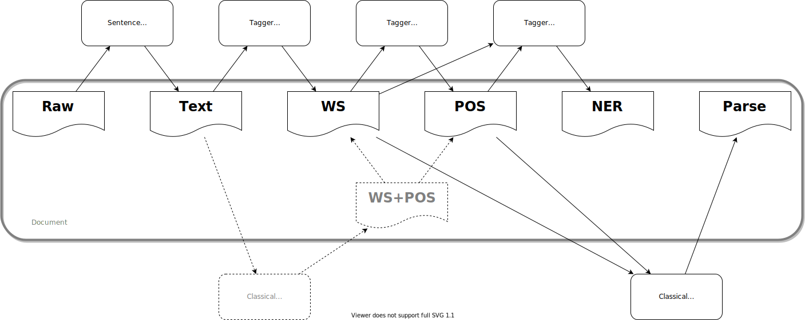

Pipelines
---------

.. include:: ../_defn.rst

Core Pipeline
^^^^^^^^^^^^^

The |CkipPipeline| connect `drivers <usage/driver.html>`_ of sentence segmentation, word segmentation, part-of-speech tagging, named-entity recognition, and sentence parsing.

The |CkipDocument| is the workspace of |CkipPipeline| with input/output data. Note that |CkipPipeline| will store the result into |CkipDocument| in-place.

The |CkipPipeline| will compute all necessary dependencies. For example, if one calls :meth:`get_ner` with only raw-text input, the pipeline will automatically calls :meth:`get_text`, :meth:`get_ws`, :meth:`get_pos`.

.. code-block:: python

   from ckipnlp.pipeline import CkipPipeline, CkipDocument

   pipeline = CkipPipeline()
   doc = CkipDocument(raw='中文字耶，啊哈哈哈')

   # Word Segmentation
   pipeline.get_ws(doc)
   print(doc.ws)
   for line in doc.ws:
       print(line.to_text())

   # Part-of-Speech Tagging
   pipeline.get_pos(doc)
   print(doc.pos)
   for line in doc.pos:
       print(line.to_text())

   # Named-Entity Recognition
   pipeline.get_ner(doc)
   print(doc.ner)

   # Constituency Parsing
   pipeline.get_constituency(doc)
   print(doc.constituency)

   ################################################################

   from ckipnlp.container.util.wspos import WsPosParagraph

   # Word Segmentation & Part-of-Speech Tagging
   for line in WsPosParagraph.to_text(doc.ws, doc.pos):
       print(line)

Co-Reference Pipeline
^^^^^^^^^^^^^^^^^^^^^

The |CkipCorefPipeline| is a extension of |CkipPipeline| by providing coreference resolution. The pipeline first do named-entity recognition as |CkipPipeline| do, followed by alignment algorithms to fix the word-segmentation and part-of-speech tagging outputs, and then do coreference resolution based sentence parsing result.

The |CkipCorefDocument| is the workspace of |CkipCorefPipeline| with input/output data. Note that |CkipCorefDocument| will store the result into |CkipCorefPipeline|.

.. image:: ../../image/coref_pipeline.svg

.. code-block:: python

   from ckipnlp.pipeline import CkipCorefPipeline, CkipDocument

   pipeline = CkipCorefPipeline()
   doc = CkipDocument(raw='畢卡索他想，完蛋了')

   # Co-Reference
   corefdoc = pipeline(doc)
   print(corefdoc.coref)
   for line in corefdoc.coref:
       print(line.to_text())
